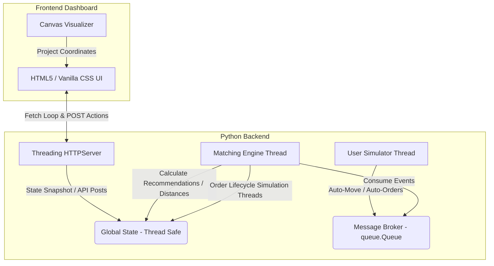

# 🛵 Zomato Live: Real-Time Operations Central & Match Dispatch Simulator

A high-performance, multi-threaded simulation mimicking real-time food delivery platforms like Zomato or Uber Eats. It demonstrates asynchronous event handling, real-time spatial recommendations, concurrent order state machines, and a dynamic HTML5 Canvas operations dashboard.

---

## 🏗️ Architecture Overview

The system is split into a multi-threaded Python backend and a lightweight, interactive frontend dashboard:



### 1. The Multi-Threaded Engine (Python Backend)
* **Thread-Safe Global State (`GlobalState`)**: Implements strict thread-safety using Python's `threading.Lock` to coordinate real-time updates of users, restaurants, recommendations, orders, and configuration variables.
* **Message Broker (`MessageBroker`)**: A simulated pub-sub queue utilizing `queue.Queue` to handle system-wide events asynchronously.
* **Location-Based Matching Engine (`MatchingEngine`)**: Computes great-circle distances between customers and restaurants dynamically using the **Haversine formula**. It updates available restaurant recommendations for online customers in real-time (within a default 5.0 km radius).
* **Simulators**:
  * **User Simulator**: Runs random walks (real-time user coordinate changes) and schedules randomized mock order placement.
  * **Order Lifecycle Simulator**: Spawns detached threads executing state transitions: `PENDING` ➔ `PREPARING` ➔ `OUT_FOR_DELIVERY` ➔ `DELIVERED`.
* **Lightweight Web API**: A `ThreadingHTTPServer` that hosts dashboard static files and processes REST API payloads.

### 2. Operations Central Dashboard (Frontend)
* **Live Location Dispatch Grid**: Built on HTML5 Canvas. Projects geographical coordinates (Lat/Lon) to screen pixels. It draws connection lines representing the closest restaurant match, glows active browsing sessions, and enables dragging/teleportation interactively.
* **Customer Control Hub**: Enables testing system responsiveness by manually choosing a customer, browsing menus, and ordering specific items.
* **Kanban-Style Live Order Board**: Tracks simulated order progress through Pipeline Columns (Pending ➔ Kitchen ➔ Delivery ➔ Delivered).
* **Live Message Logs Terminal**: Streams events from the `MessageBroker` in real-time.

---

## ⚡ Key Features

* **Visual Teleportation**: Click anywhere on the map to relocate the selected customer. The nearest restaurant recommendations are updated instantly.
* **Interactive Toggles**: Tweak `🤖 Auto-Move` (users wander around Mumbai) and `🍕 Auto-Orders` (automated customer orders) via dashboard control pills.
* **Broker Event Stream**: View structural logs like `USER_MOVE`, `RECOMMENDATION_MATCHED`, `NEW_ORDER`, and `ORDER_STATUS_UPDATE` as they happen.
* **Simulate Custom Orders**: Browse cuisine-specific menus (Indian, Italian, Japanese, etc.), increment item quantities, and place custom orders directly from the UI.

---

## 🚀 Getting Started

### Prerequisites
* **Python 3.x**
* No external dependencies required (built entirely using Python standard libraries).

### Running the Simulator
1. Clone the repository and navigate to the directory:
   ```bash
   git clone https://github.com/riddhi-z1465/Food_Delivery_System.git
   cd Food_Delivery_System
   ```
2. Start the simulation:
   ```bash
   python3 simulation.py
   ```
3. Open your browser and navigate to:
   ```
   http://127.0.0.1:8080/
   ```

---

## 🔌 API Reference

The backend exposes a JSON REST API for querying and controlling the simulator:

### 1. Get Simulation Snapshot
* **Endpoint:** `GET /data`
* **Response:** Returns the complete system state snapshot (users, restaurants, orders, recommendations, event streams, and configs).

### 2. Place Custom Order
* **Endpoint:** `POST /api/orders`
* **Body:**
  ```json
  {
    "user_id": "USER-1",
    "restaurant_id": "REST-001",
    "item_name": "Paneer Butter Masala",
    "quantity": 2,
    "total_amount": 560.00
  }
  ```

### 3. Update User Location
* **Endpoint:** `POST /api/users/location`
* **Body:**
  ```json
  {
    "user_id": "USER-1",
    "lat": 19.0772,
    "lon": 72.8762
  }
  ```

### 4. Create Dynamic User
* **Endpoint:** `POST /api/users/add`
* **Body:**
  ```json
  {
    "name": "Rohan",
    "preference_cuisine": "Italian",
    "lat": 19.0760,
    "lon": 72.8777
  }
  ```

### 5. Update Simulation Config
* **Endpoint:** `POST /api/config`
* **Body:**
  ```json
  {
    "auto_move_enabled": true,
    "auto_orders_enabled": false
  }
  ```
