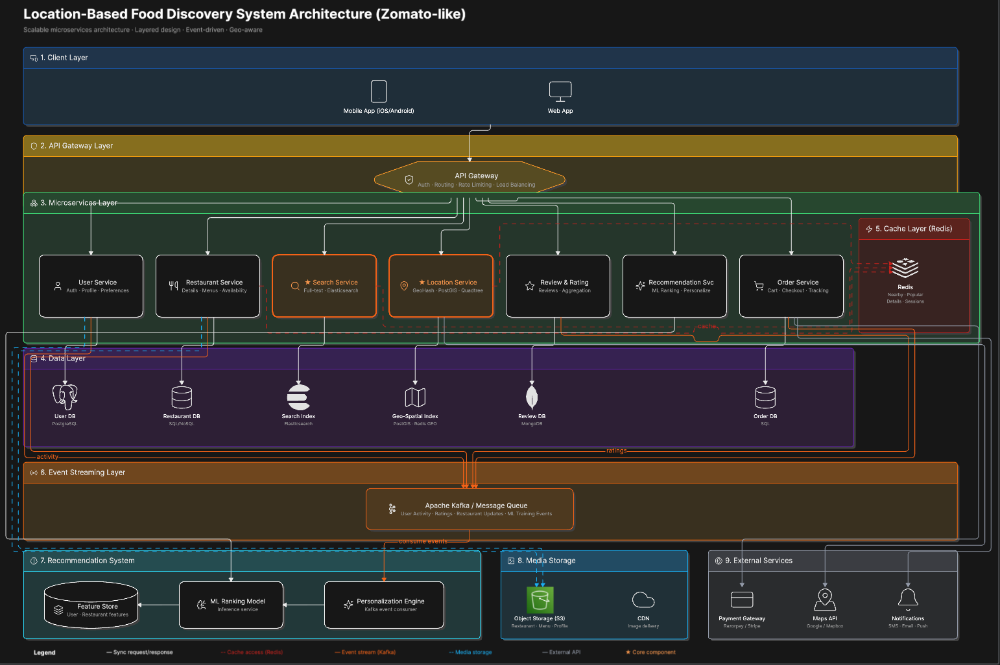

# 🛵 Zomato Live: Real-Time Operations Central & Match Dispatch Simulator

A high-performance, multi-threaded simulation mimicking real-time food delivery platforms like Zomato or Uber Eats. It demonstrates asynchronous event handling, real-time spatial recommendations, concurrent order state machines, and a dynamic HTML5 Canvas operations dashboard.

---

## 📖 Project Overview

**Zomato Live** is an interactive, real-time operations dashboard and match dispatch simulator. The application consists of two primary layers:

### 1. The Multi-Threaded Engine (Python Backend)
* **Thread-Safe Global State (`GlobalState`)**: Implements strict thread-safety using Python's `threading.Lock` to coordinate real-time updates of users, restaurants, recommendations, orders, and configuration variables.
* **Message Broker (`MessageBroker`)**: A simulated pub-sub queue utilizing `queue.Queue` to handle system-wide events asynchronously.
* **Location-Based Matching Engine (`MatchingEngine`)**: Computes great-circle distances between customers and restaurants dynamically using the **Haversine formula**. It updates available restaurant recommendations for online customers in real-time (within a default 5.0 km radius).
* **Simulators**:
  * **User Simulator**: Runs random walks (real-time user coordinate changes) and schedules randomized mock order placement.
  * **Order Lifecycle Simulator**: Spawns detached threads executing state transitions: `PENDING` ➔ `PREPARING` ➔ `OUT_FOR_DELIVERY` ➔ `DELIVERED`.
* **Lightweight Web API**: A `ThreadingHTTPServer` that hosts dashboard static files and processes REST API payloads.

### 2. Operations Central Dashboard (Frontend)
* **Live Location Dispatch Grid**: Built on HTML5 Canvas. Projects geographical coordinates (Lat/Lon) to screen pixels. It draws connection lines representing the closest restaurant match, glows active browsing sessions, and enables dragging/teleportation interactively.
* **Customer Control Hub**: Enables testing system responsiveness by manually choosing a customer, browsing menus, and ordering specific items.
* **Kanban-Style Live Order Board**: Tracks simulated order progress through Pipeline Columns (Pending ➔ Kitchen ➔ Delivery ➔ Delivered).
* **Live Message Logs Terminal**: Streams events from the `MessageBroker` in real-time.

---

## 🛠️ Setup Instructions

To get the simulation up and running on your local machine, follow these steps:

1. **Clone the Repository**
   Clone the repository and navigate to the project directory:
   ```bash
   git clone https://github.com/riddhi-z1465/Food_Delivery_System.git
   cd "Food Delivery System"
   ```

2. **Verify Python Installation**
   Ensure you have Python 3.x installed. You can check your version by running:
   ```bash
   python3 --version
   ```

3. **Check File Permissions (Optional)**
   Make sure the main python script has execution permissions:
   ```bash
   chmod +x food_delivery.py
   ```

---

## 📦 Dependencies

The project is designed to be lightweight and extremely easy to run, requiring **zero external packages or libraries**.

* **Backend Dependencies (Standard Library):**
  - `threading`: For concurrent simulator execution and hosting the server.
  - `queue`: Simulating pub-sub message ingestion.
  - `http.server`: Serving static dashboard files and routing API request handlers.
  - `math`: Calculation of distances via the Haversine formula.
  - `json`, `uuid`, `logging`, `time`, `random`: Core utility modules.
* **Frontend Dependencies:**
  - Standard HTML5, CSS3, and JavaScript (Vanilla CSS, vanilla JS with no external frameworks or libraries).
  - HTML5 Canvas API for geo-spatial rendering.

---

## 🚀 Execution Steps

1. **Start the Simulator**
   Run the following command in your terminal from the project root directory:
   ```bash
   python3 food_delivery.py
   ```
   *Note: The script automatically checks for and terminates any stale process occupying the target port (default 8080).*

2. **Open the Dashboard**
   Launch your web browser and navigate to:
   ```
   http://127.0.0.1:8080/
   ```

3. **Interact with the Simulation**
   * **Visual Teleportation**: Click anywhere on the map grid to relocate the selected customer. The nearest restaurant recommendations will update instantly.
   * **Interactive Toggles**: Tweak `🤖 Auto-Move` (users wander around Mumbai) and `🍕 Auto-Orders` (automated customer orders) via dashboard control pills.
   * **Simulate Custom Orders**: Browse cuisine-specific menus (Indian, Italian, Japanese, etc.), increment item quantities, and place custom orders directly from the UI.
   * **Monitor System Logs**: View structural logs like `USER_MOVE`, `RECOMMENDATION_MATCHED`, `NEW_ORDER`, and `ORDER_STATUS_UPDATE` as they stream live on the Operations terminal.

---

## 🔍 Additional Project Details

### 1. Production-Grade Microservices Architecture (Zomato-Like)
At production scale, the simple multi-threaded simulation scales up to a robust, layered, event-driven microservices system:



#### Architectural Breakdown
1. **Client Layer**: The client application (Mobile/Web) sends API calls and telemetry updates.
2. **API Gateway Layer**: Manages security, authentication, and balances/routes requests to target microservices.
3. **Microservices Layer**: Distributed autonomous microservices handling specialized scopes:
   - **User Service**: Manages accounts, profiles, and cuisine preferences.
   - **Restaurant Service**: Manages menus, restaurant metadata, and operation times.
   - **Search Service**: Performs fuzzy-search matches over menus.
   - **Location Service**: Tracks active delivery rider GPS and handles distance/ETA queries.
   - **Review Service**: Registers user feedback and tracks rating scores.
   - **Recommendation Service**: Powers discovery screens with personalized feeds.
   - **Order Service**: Coordinates order placement, payments, and delivery orchestration.
4. **Cache Layer**: Redis buffers queries for nearby venues, geo-spatial lists, and active session details.
5. **Data Layer**: Specialized polyglot storage databases matching individual service needs (e.g. relational PostgreSQL/MySQL, search indexes in Elasticsearch, geo-indices in PostGIS/Redis, and MongoDB for reviews).
6. **Event Streaming Layer**: Apache Kafka acts as the event-driven backbone, broadcasting high-volume updates (e.g., rider location tracks, order status telemetry).
7. **Recommendation System**: Aggregates behavioral features into a Feature Store to serve real-time predictions via an ML Ranking model.
8. **Media Storage**: Uses cloud object storage (e.g., AWS S3) cached close to the user via a Content Delivery Network (CDN) for fast image rendering.
9. **External Services**: Interfaces with third-party networks for processing payments, rendering map interfaces, and pushing app notifications.

### 2. API Reference
The backend exposes a JSON REST API for querying and controlling the simulator:

* **Get Simulation Snapshot**
  * **Endpoint:** `GET /data`
  * **Response:** Returns the complete system state snapshot (users, restaurants, orders, recommendations, event streams, and configs).

* **Place Custom Order**
  * **Endpoint:** `POST /api/orders`
  * **Body:**
    ```json
    {
      "user_id": "USER-1",
      "restaurant_id": "REST-001",
      "item_name": "Paneer Butter Masala",
      "quantity": 2,
      "total_amount": 560.00
    }
    ```

* **Update User Location**
  * **Endpoint:** `POST /api/users/location`
  * **Body:**
    ```json
    {
      "user_id": "USER-1",
      "lat": 19.0772,
      "lon": 72.8762
    }
    ```

* **Create Dynamic User**
  * **Endpoint:** `POST /api/users/add`
  * **Body:**
    ```json
    {
      "name": "Rohan",
      "preference_cuisine": "Italian",
      "lat": 19.0760,
      "lon": 72.8777
    }
    ```

* **Update Simulation Config**
  * **Endpoint:** `POST /api/config`
  * **Body:**
    ```json
    {
      "auto_move_enabled": true,
      "auto_orders_enabled": false
    }
    ```
